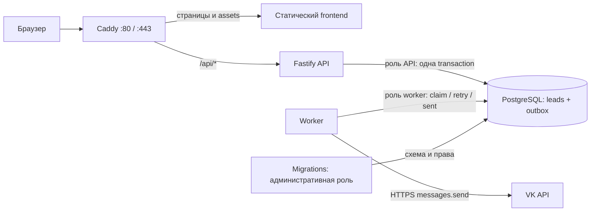

# Архитектура

Проект — pnpm monorepo и modular monolith. React-приложение, Fastify API и фоновые уведомления имеют отдельные точки запуска. API, worker и migrations используют один backend package и один production image. Общая база PostgreSQL хранит заявки и очередь уведомлений; отдельный брокер сообщений не нужен.

Только Caddy публикует порты на сервере. Frontend работает в непривилегированном nginx-контейнере; Vite используется только при сборке. API, migrations и worker запускаются непривилегированным пользователем node. Файловые системы приложений доступны только для чтения, временные файлы размещаются в tmpfs. PostgreSQL и сертификаты Caddy хранятся в именованных volumes.

## Frontend: FSD-lite

Направление зависимостей: `app → pages → widgets → features → entities → shared`. Страницы собирают блоки, widgets содержат крупные композиционные секции, features описывают действие пользователя. Статические секции не становятся features. `shared/ui` содержит небольшую используемую дизайн-систему; Atomic Design не определяет слои приложения.

- `app`: providers, React Router, глобальные стили и design tokens.
- `pages`: главная, каталог, список кейсов, кейс по slug, контакты, политика, 404.
- `widgets`: header, hero, тематические секции главной, consultation, footer.
- `features/lead-form`: валидация, отправка, повторная попытка и состояние результата.
- `features/open-lead-modal`: контекст открытия общей модальной формы.
- `entities/case`: типизированный контент, карточка и небольшая граница источника данных.
- `shared`: компоненты, API transport, SEO, assets и общие утилиты.

Повторяющиеся данные размещаются рядом с соответствующим widget/entity. Локальный `caseRepository` предоставляет `list()` и `findBySlug()`; позже реализацию можно заменить на CMS/API, сохранив контракт страниц. React Router загружает дополнительные страницы отдельными chunks. SEO metadata и sitemap используют публичный URL из `VITE_SITE_URL` во время сборки.

## Backend: Clean Architecture-lite

`modules/leads` отделяет HTTP валидацию/ответ от сценария создания и PostgreSQL repository. Общие Zod contracts используются в браузере и API. Общая конфигурация проверяется при запуске; неправильный URL или неизвестное значение не превращается в частично рабочий сервер.

POST `/api/leads`:

1. Ограничение размера JSON, rate limit, origin-проверка, honeypot и Zod validation.
2. Нормализация ввода и поиск/уникальное ограничение `client_request_id`.
3. Одна PostgreSQL transaction записывает `leads` и `notification_outbox`.
4. После commit API возвращает `{ accepted: true, id }`.

Если outbox insert завершился ошибкой, вся transaction откатывается. Повторный `clientRequestId` возвращает ID сохранённой заявки и не создаёт новый outbox. Браузер сохраняет ID конкретной попытки при сетевой ошибке: пользователь может безопасно повторить отправку. После успеха форма очищается и следующая заявка получает новый ID.

## Поля заявки и обновление схемы

Shared `CreateLeadRequestSchema` задаёт обязательные `name` и `phone`, необязательный `message` и обязательное `consent: true`. Имя обрезается по краям, повторяющиеся пробелы объединяются; телефон приводится к `+` и цифрам, российский префикс `8` у 11-значного номера заменяется на `7`. Пустой/пробельный комментарий преобразуется в `NULL`. Атрибуция страницы, источника, реферера и UTM хранится вместе с заявкой; `client_request_id` отвечает за идемпотентность.

Поля `email` и `company` удалены из контракта, формы, application mapping, текущей Drizzle-схемы и VK-форматирования. API использует strict-объект: запрос со старым полем получает 400 до начала транзакции. В таблице `leads` имя и телефон остаются `NOT NULL`; комментарий nullable. `consent_version` сохраняет текущую версию согласия `2026-09-10` для новых и существующих записей.

Миграция `0001_simplify_lead_fields.sql` удаляет только две устаревшие колонки. Исходная `0000` и её запись в журнале не переписываются. Обновление не меняет ID, контактные номера, комментарии, метаданные или `notification_outbox`. Поскольку старый API/worker выбирает прежние колонки, при обновлении сначала останавливают эти процессы, затем применяют миграцию из нового image. Резервную копию проверяют восстановлением в отдельную БД; хэши сохранённых полей и полного outbox сравнивают до запуска нового worker.

## Доступ к PostgreSQL

Административная роль PostgreSQL остаётся владельцем базы и схемы и используется для миграций и обслуживания. Compose передаёт её подключение только `migrate`; длительно работающие API и worker подключаются через две разные ограниченные роли. Каждому контейнеру передаётся только его `DATABASE_URL`, без паролей других ролей. VK token остаётся только у worker.

| Процесс                 | Разрешения на данные приложения                                                                                                                          |
| ----------------------- | -------------------------------------------------------------------------------------------------------------------------------------------------------- |
| API (`povod_api`)       | `INSERT` в `leads` и `notification_outbox`; `SELECT` только `leads.id` и `leads.client_request_id` для ответа и идемпотентности                          |
| Worker (`povod_worker`) | `SELECT` обеих таблиц; `UPDATE` только `status`, `attempts`, `next_attempt_at`, `locked_at`, `locked_by`, `last_error`, `updated_at`, `sent_at` в outbox |
| Migrate (администратор) | Изменение схемы и явная настройка ролей после применения Drizzle migrations                                                                              |

Рабочие роли не являются суперпользователями, владельцами объектов или членами других ролей; они не могут создавать роли, базы, схемы и временные таблицы, удалять или очищать таблицы, менять структуру и журнал миграций. У API нет чтения имён, телефонов и комментариев уже сохранённых заявок; worker читает их для отправки VK, но не может изменять. Доступ через `PUBLIC` к рабочей базе/схемам ограничивается при настройке, чтобы общие права не отменяли эту изоляцию.

Команда миграций проверяет конфигурацию ролей до изменения схемы. После SQL migrations отдельная транзакция создаёт/обновляет роли и выдаёт права на конкретные существующие таблицы и столбцы. Она не выдаёт широкие default privileges на будущие объекты. Поэтому новая таблица или новый сценарий доступа требуют явного изменения настройки прав и соответствующей проверки. Частичная конфигурация и отсутствие рабочих паролей в production завершают `migrate` ошибкой, а Compose не запускает зависимые сервисы.

Роли с указанными именами могут обновляться повторно только при наличии служебной метки этой базы и сервиса; совпадение с чужой, привилегированной ролью, владельцем или членом других ролей приводит к ошибке. Подробности первоначального запуска, обновления существующей базы, восстановления и смены паролей — в [database-access.md](database-access.md).

## Outbox и доставка VK

Worker выбирает только `vk.lead.created` с PostgreSQL `FOR UPDATE SKIP LOCKED` и атомарно выставляет `processing`, `locked_at`, `locked_by`. Блокировка не удерживается во время HTTP. Зависшие задачи возвращаются в `pending` после `WORKER_LOCK_MS` (по умолчанию 120 секунд). Worker обрабатывает задачи последовательно; при пустой очереди ждёт `WORKER_POLL_MS` (3 секунды).

В `notification_outbox.random_id` хранится уникальный положительный integer identity. Его выделяет PostgreSQL, поэтому параллельные заявки не получают один ID; повторная доставка использует прежнее значение. `messages.send` вызывается HTTPS POST с токеном сообщества, `group_id`, выбранным `peer_id`, закреплённой версией API и этим `random_id`. Токен не включается в URL. Для обычного текста отключены разбор упоминаний и предпросмотр ссылок.

Успехом считается корректный числовой `response` в HTTP 2xx. VK может вернуть `error.error_code` при HTTP 200 — такая задача не помечается отправленной. Сетевые ошибки, timeout, неверный JSON, HTTP 429/5xx и VK 6/9/10/29 оставляют задачу для retry. HTTP `Retry-After` учитывается. Ошибки авторизации, прав или адресата повторяются реже (минимум через час), чтобы после исправления настроек очередь продолжила работать. В базе и логах сохраняется только стабильный код вроде `vk_api_901`, без ответа API, `request_params`, токена или текста заявки.

Обычный retry: 30–60 секунд, затем 60–120, 120–240 и далее с экспоненциальным увеличением и jitter до 12–24 часов; `Retry-After` может увеличить задержку. Ограничения числа попыток и автоматического удаления очереди нет. HTTP timeout задаётся `VK_TIMEOUT_MS` (15 секунд). Внешний сбой может отложить уведомление, но не меняет успешный ответ формы после commit в PostgreSQL.

Стабильный `random_id` позволяет VK распознавать повторный запрос при неопределённом результате HTTP или сбое после принятия сообщения. Точная область/срок внешней дедупликации не задаются приложением, поэтому exactly once не гарантируется. При переносе базы сохраняют identity sequence; независимым отправителям от одного сообщества нужна общая выдача ID или непересекающиеся диапазоны.

Миграция `0002_vk_notifications.sql` назначает `random_id` всем существующим outbox-строкам, меняет default типа и переводит только неотправленные задачи на VK. Уже отправленные строки сохраняют исторический тип и не выбираются новым worker. Идентификаторы заявок, payload, attempts, даты и прочие поля сохраняются. Перед применением останавливают старый worker и создают проверенную резервную копию. Инструкция настройки: [vk-setup.md](vk-setup.md).

## Надёжность, безопасность и эксплуатация

- `GET /api/health/live` проверяет процесс, `GET /api/health/ready` проверяет PostgreSQL.
- Migrations и настройка рабочих DB-ролей выполняются отдельным Compose service с административным подключением; API/worker ждут успешного завершения и используют только собственные ограниченные подключения.
- Caddy завершает TLS, сжимает ответы, добавляет CSP и защитные заголовки. Внутренние сервисы не публикуют порты.
- `PUBLIC_ORIGIN` ограничивает browser POST одним origin; `TRUST_PROXY_HOPS=1` соответствует одному внешнему Caddy. При добавлении CDN схему доверия нужно пересмотреть.
- Rate limit хранится в памяти одного API процесса. Для одного сервера этого достаточно; при нескольких API replicas понадобится общая политика ограничений.
- JSON logs содержат request/lead/outbox IDs, попытку и результат; заявки и секреты целиком не логируются.
- Docker logs ротируются; база резервируется отдельно. Volumes обеспечивают сохранность при restart, но не заменяют резервную копию на другом носителе.

## Расширение без лишних слоёв

Новая страница добавляется в `pages` и router; её композиции могут переиспользовать widgets. Новая форма использует текущую feature, когда сохраняет тот же тип заявки. Для другого бизнес-сценария добавляются отдельный shared contract, application use case и endpoint. Каталог, статьи и CMS подключаются по мере реальной необходимости; административная панель, Redis и брокер сообщений сейчас отсутствуют.

Рабочее название сервиса — «Сладкий Дар». Он предназначен для оптовой продажи подарочных наборов с продукцией Kinder. Тексты, кейсы и replacement assets являются демонстрационным наполнением. Перед реальной публикацией нужны реальные контакты, согласованные сведения о компании, условия обработки данных и подтверждённые кейсы. Демонстрационное наполнение не является заявлением о выполненных проектах.
